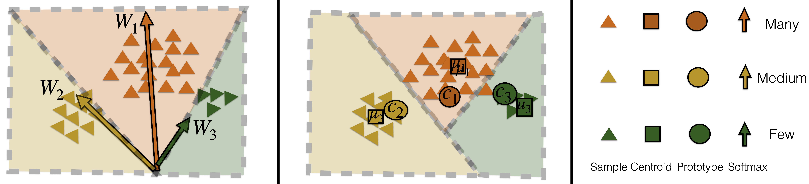

# prototype-classifier-ltr
Code for our IJCAI 23 paper "Learning Prototype Classifiers for Long-Tailed Recognition"


# Train first stage models
Use training code from https://github.com/ShadeAlsha/LTR-weight-balancing.

Place trained models in ./logs/<dataset_name>/wd_baseline_imba<imba_ratio>

# Train Prototype classifier 
```
python main.py --freeze_feats --ncm_classifier --autoaug --use_logit_adj --pretrained_model_dir ./logs/<dataset_name>/wd_baseline_imba<imba_ratio> --log_dir ./logs/<dataset_name>/prototype_classifier_imba<imba_ratio>
```
## Citing 

If you use this code, please cite our work : 
```
@article{sharma2023learning,
  title={Learning Prototype Classifiers for Long-Tailed Recognition},
  author={Sharma, Saurabh and Xian, Yongqin and Yu, Ning and Singh, Ambuj},
  journal={arXiv preprint arXiv:2302.00491},
  year={2023}
}
```
